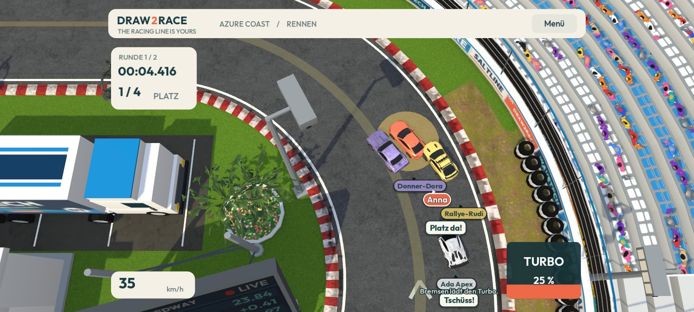
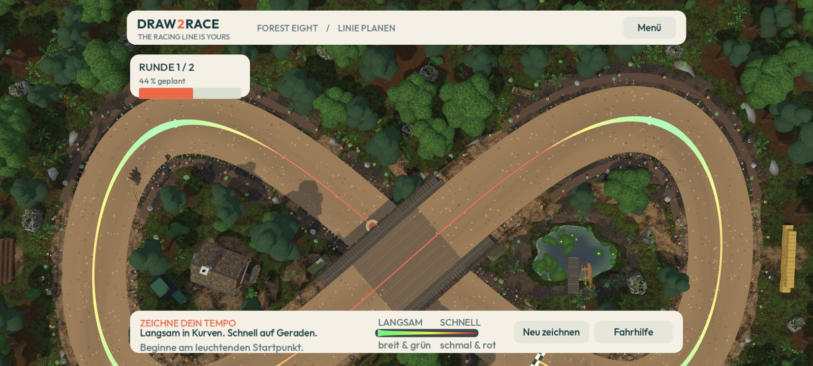
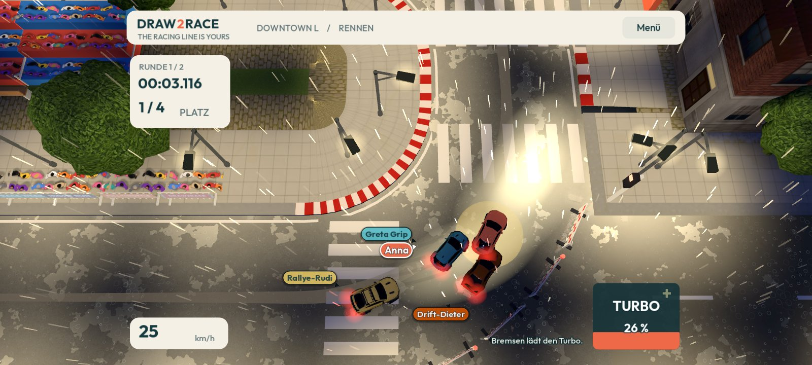
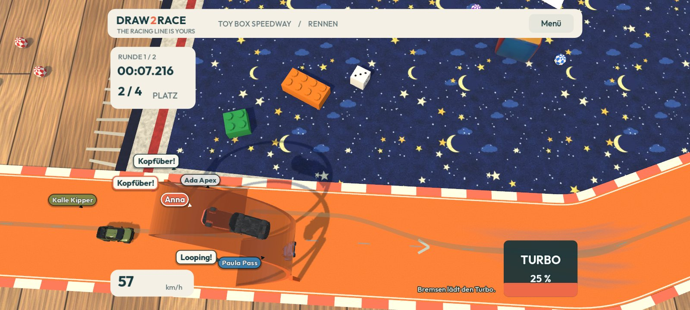
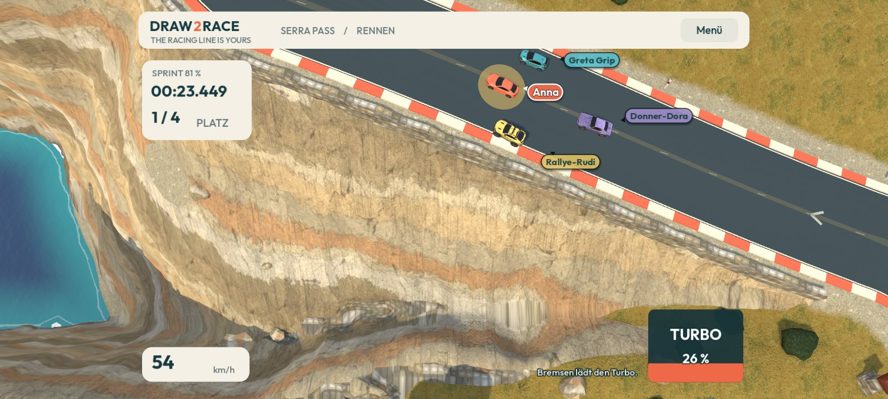
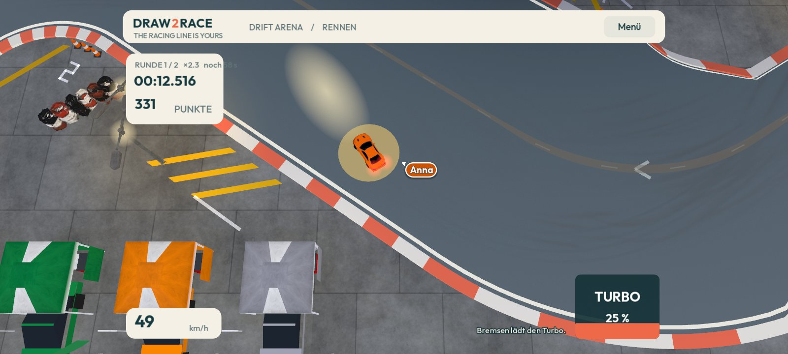
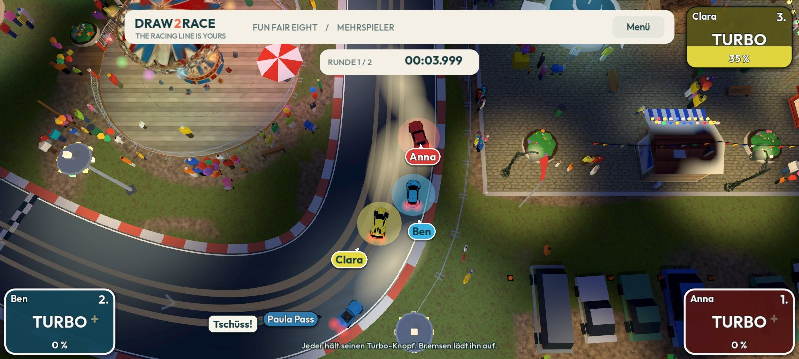
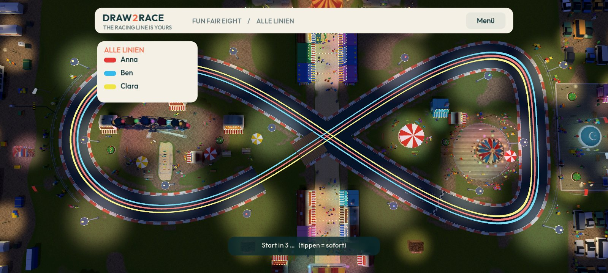
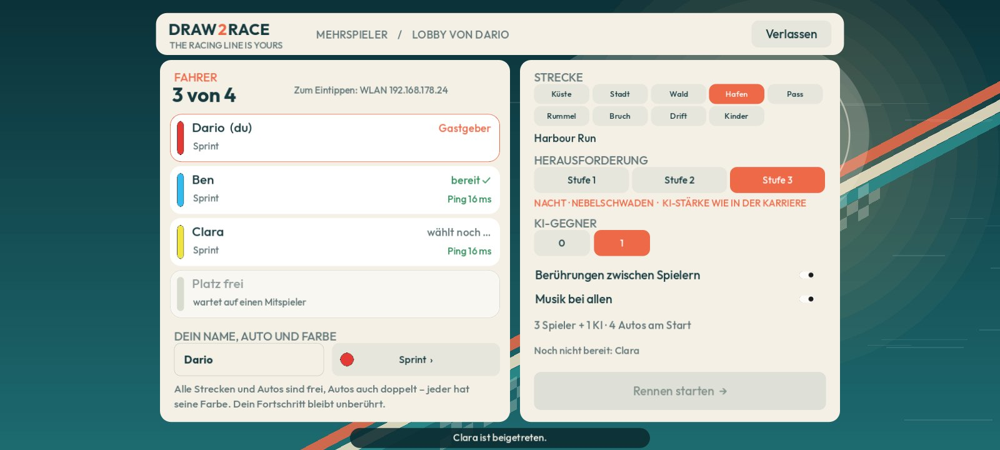
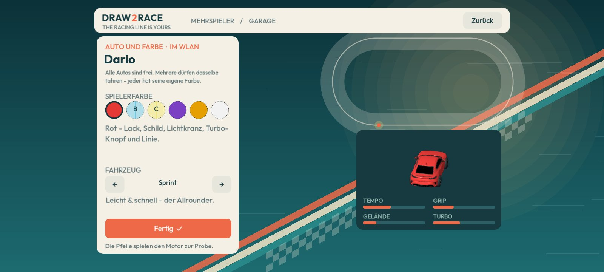

# Draw2Race

**Zeichne deine Ideallinie – die Fahrphysik macht den Rest.**

Ein Rennspiel für Android, bei dem du nicht lenkst, sondern planst: Du zeichnest mit dem Finger zwei Runden Ideallinie, und **wie schnell** du zeichnest, ist das Tempo, das dein Auto fahren will. Dann startet das Rennen, und die Fahrphysik zeigt, ob deine Linie hält. Bremsweg, Haftungsgrenze, Rutschen und Dreher entstehen aus der Bewegung des Autos, nicht aus einer Animation.

**Version 1.0** · Android · offline spielbar · Mehrspieler mit bis zu 4 Handys · Godot 4.6.1 · nicht-kommerzielles Hobbyprojekt

<p align="center"></p>

## Version 1.0 – was drinsteckt

- **Neun Strecken** mit eigener Kulisse, vom Küstenstadion über Stadt, Wald, Hafen und Jahrmarkt bis zur Steilküste und zum Kinderzimmer. Dazu kommen Höhenniveaus, Sprünge, Loopings, Brücken und eine Wippe.
- **Karriere** mit drei Gold-Herausforderungen je Strecke, Tag und Nacht, Regen, Schnee und Nebel, acht freischaltbaren Autos und einer Bestenliste.
- **Mehrspieler für bis zu 4 Spieler, ohne Internet:** auf einem Handy zum Weitergeben oder im WLAN bzw. über den Handy-Hotspot. Alle zeichnen gleichzeitig, und alle Handys zeigen dasselbe Rennen.
- **Echte Motorklänge** aus einer physikalischen Motorsimulation, vom Dreizylinder bis zum Big-Block-V8.
- **Eigene Musik** in zwei Stilen, im Mehrspieler auf allen Handys gleich.

## Bilder

| | |
|:---:|:---:|
|  |  |
| Linie planen: breit und grün = langsam, schmal und rot = schnell | Nachtrennen im Regen durch Downtown L |
|  |  |
| Looping im Kinderzimmer, durchfahren mit eigenem Schwung | Sprint über den Serra-Pass an der Steilküste |
|  |  |
| Drift-Arena: quer durch die Kurve für Punkte | Mehrspieler auf einem Handy, jeder mit eigenem Turbo-Knopf |
|  |  |
| Vor dem Start werden die Linien aller Spieler aufgedeckt | WLAN-Lobby: Strecke, Wetter und KI-Gegner wählen |
|  | |
| Garage mit 3D-Modell, Motorprobe und Fahrwerten | |

## Spielen

1. Unter [Releases](../../releases/latest) die Datei `Draw2Race-<Version>.apk` herunterladen. Spätere Updates bietet das Spiel selbst an. Ohne Internet geht es auch von Handy zu Handy: Optionen → „Updates & Teilen“ → „Draw2Race teilen“.
2. Auf dem Android-Handy öffnen und die Installation erlauben (Installation aus unbekannten Quellen).
3. „Linie zeichnen“ antippen, am leuchtenden Startpunkt ansetzen und **zwei Runden in Pfeilrichtung** zeichnen.

**Linienkodierung:** langsam = breit und grün, schnell = schmal und rot, dazwischen gelb und orange. Wird die Linie breiter, bremst das Auto. Plane den Bremsweg also vor der Kurve ein.

**Beim Zeichnen**
- Finger abheben pausiert. Im **schimmernden Linienende** (der jüngsten Sekunde) darfst du neu ansetzen. Nach 0,5 s Weitermalen ersetzt der neue Ansatz den alten Rest, und das Tempo wird weich übergeblendet.
- Ein Finger auf freier Fläche verschiebt die Kamera, zwei Finger zoomen, ein Doppeltipp zeigt die ganze Strecke.
- Neben der Fahrbahn darfst du zeichnen, der Untergrund bremst dann. Die Wegpunkt-Tore musst du aber durchfahren.

**Im Rennen:** Turbo halten. Der Knopf zeigt den Füllstand, und beim Bremsen lädt er sich auf.

**Mehrspieler** (Menü → „Mehrspieler · 2–4 Spieler“)
- **Auf einem Handy:** Alle zeichnen nacheinander, das Handy wird weitergegeben. Danach fahren alle gemeinsam, jeder mit eigenem Turbo-Knopf in seiner Ecke.
- **Im WLAN:** Ein Handy eröffnet das Spiel im Heim-WLAN oder per Handy-Hotspot, auch beides gleichzeitig. Die anderen treten bei.
  - Alle zeichnen gleichzeitig, das Rennen rechnet der Gastgeber, und alle Handys zeigen dasselbe Bild.
  - Alle hören dieselbe Musik. Der Gastgeber kann sie bei allen abschalten.
  - Hat jemand eine ältere Version, holt er sich die neue direkt in der Lobby.
- Im Mehrspieler sind alle Strecken und Autos frei. Gleiche Autos sind erlaubt, jeder fährt in seiner eigenen Farbe. Der eigene Spielstand bleibt davon unberührt.

## Inhalt im Detail

- **Neun Strecken**, jede als gebackenes Diorama mit eigener Kulisse:
  - Azure Coast (Küstenstadion)
  - Downtown L (Stadt)
  - Forest Eight (Schotter-Acht im Wald, mit Kuppen, Senken und Holzbrücke)
  - Harbour Run (Containerhafen mit Containerterrasse und Sprung)
  - Fun Fair Eight (Jahrmarkt)
  - Quarry Loop (Steinbruch mit Looping und Sprung über die eigene Strecke)
  - Serra Pass (Bergsprint an der Steilküste)
  - Drift Arena (Drift-Modus auf Punkte)
  - Toy Box Speedway (Kinderzimmer mit Lineal-Wippe)
- **2,5D-Fahrphysik:** Schanzen, Brückenkreuzungen, Loopings, Höhenprofil und Leitplanken entstehen aus der Bewegung des Autos. Deko wie Häuser, Mauern, Pfosten und Bäume hat einen Körper, wer hineinzeichnet, kracht. Die Simulation ist deterministisch, jedes Handy rechnet gleich.
- **Karriere:** je Strecke drei Gold-Herausforderungen mit bis zu drei Rivalen. Gold schaltet Strecken und acht Autos mit eigenen Fahrwerten frei.
- **Motoren:** Jedes Auto klingt wie sein Motor, vom Dreizylinder bis zum V12 und Big-Block-V8. Aufgenommen mit einer physikalischen Motorsimulation, mit Begrenzer, Fehlzündungen und Turbo.
- **Tageszeit, Wetter, Nebel:** fest je Herausforderung, von Tag bis Nacht, mit Regen, Schnee und Nebelschwaden. Nässe und Schnee senken die Haftung.
- **Bestenliste:** die zehn schnellsten Fahrten je Strecke und Herausforderung, dazu ein Geisterauto der eigenen Bestfahrt.
- **Namen und Sprechblasen:** Namensschilder über den Autos und kurze Blasen bei Ereignissen wie „Überholt!“ oder „Dreher!“. Beides ist abschaltbar.
- **Musik:** eine durchgehende Zufalls-Playlist in zwei Stilen, „energiegeladen“ mit Gesang und „ruhig“ instrumental, dazu eigene Stücke für Sieg und Niederlage.
- **Einstellungen:** Rennkamera, Tempo der Linie, Grafikqualität, getrennte Lautstärken für Musik und Geräusche.

## Selbst bauen

```powershell
./tools/setup.ps1              # lädt Godot 4.6.1 und Exportvorlagen nach .tools/
./tools/build.ps1 -Target Test # Headless-Prüfungen
./tools/build.ps1 -Target All  # Windows- und Android-Build nach builds/
```

Android benötigt zusätzlich JDK 17 und das Android SDK. Strecken sind Daten (`game/tracks/*.json`), erzeugt mit `tools/make_tracks.py`.

## Unterlagen

- [Implementierung und Teststand](docs/IMPLEMENTIERUNG.md)
- [Gestaltungs- und Spielrichtlinien](docs/RICHTLINIEN.md)
- [Umsetzungsplan](docs/UMSETZUNGSPLAN.md)
- [Referenzanalyse](docs/REFERENZANALYSE.md) und [Klang-Steckbriefe](docs/KLANG_STECKBRIEFE.md)
- [Grafikbesprechung mit ChatGPT (30.09.2026)](docs/BESPRECHUNG_GRAFIK.md)
- [Dioramen-Pipeline und Strecken](docs/dioramen/README.md)
- [Lokaler Mehrspieler: Recherche (03.10.2026)](docs/MULTIPLAYER_RECHERCHE.md)

## Herkunft und Lizenzen

Draw2Race steht unter **[CC BY-NC 4.0](LICENSE)**: Teilen und Verändern mit Namensnennung erlaubt, kommerzielle Nutzung nicht.

- **Musik:** eigene Stücke, lokal mit dem KI-Musikmodell **YuE2** erzeugt. Das Modell steht unter einer nicht-kommerziellen Lizenz (CC BY-NC 4.0); die Musik darf daher ebenfalls nur nicht-kommerziell genutzt werden.
- **Engine:** [Godot Engine](https://godotengine.org) (MIT), Lizenztexte in `game/assets/Godot-LICENSE.txt` und `Godot-COPYRIGHT.txt`.
- **Schrift:** Outfit (SIL Open Font License 1.1), `game/assets/OFL.txt`.
- **Motorgeräusche:** aufgenommen mit [engine-sim](https://github.com/ange-yaghi/engine-sim) von Ange Yaghi (MIT); abgeleitete Motorbeschreibungen und Lizenztext in `tools/engine_sim/`.
- **Texturen:** Böden und Beläge teils von [ambientCG](https://ambientcg.com) (CC0), sonst prozedural erzeugt; Herkunft jeweils in `HERKUNFT.md` neben den Dateien.
- **Inspiration:** Das Spielprinzip ist von *DrawRace 2* (RedLynx) inspiriert. Grafik, Strecken, Fahrzeuge, Musik und Geräusche sind eigene Arbeiten; aus dem Original wurde nichts übernommen.
